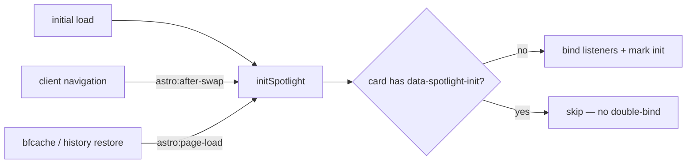

# Design: Session UI Polish — Baseline Registration + Hardening

## Technical Approach

Baseline-first: the shipped 2026-09-10 work stays untouched; this change applies three targeted hardening fixes (D1, Q1, Q2) plus commit scoping (D6). Each fix is localized to lines already verified in `exploration.md`. No new dependencies, no architecture change. Astro 7.2.10 APIs verified locally (`node_modules/astro`) before choosing each mechanism.

## Fix 1 — D1: configurable root tag on SpotlightCard

**Touch points**: `SpotlightCard.astro:13-31` (Props + destructure), `:34` and `:44` (root markup), `ProjectCard.astro:14` (consumer).

**Astro 7 API verification**: `Astro.Element` is NOT a documented Astro 7 API — it is absent from the current experimental-flags list (client-prerender, content-intellisense, chrome-devtools-workspace, svg-optimization, collection-storage, incremental-build), has no reference page on docs.astro.build, and no stable `AstroElement` runtime was found in the installed 7.2.10 package. The documented v7 mechanism for a dynamic root tag is the **capitalized-variable dynamic tag** pattern (Template expressions reference → "Dynamic Tags"):

```astro
---
import type { HTMLTag } from 'astro/types'; // verified export (astro/types.d.ts)
interface Props { as?: HTMLTag; /* …existing props… */ }
const { as: RootTag = 'div', /* … */ } = Astro.props;
---
<RootTag data-spotlight class:list={…} style={…}> … </RootTag>
```

`data-spotlight` stays on the root regardless of tag, so the JS selector (`:48`) and all `[data-spotlight]` CSS are unchanged. `ProjectCard.astro:14` becomes `<SpotlightCard as="article" class="project-card …">`. Dynamic-tag caveats checked and irrelevant here: variable must be capitalized (it is); hydration directives unsupported on dynamic tags (card root has none).

## Fix 2 — Q1: view-transition init listener

**Touch point**: `SpotlightCard.astro:80` (one added line after it).

```js
initSpotlight();                                                        // :78 (existing)
document.addEventListener('astro:page-load', initSpotlight);            // NEW
document.addEventListener('astro:after-swap', initSpotlight);           // :80 (existing)
```

Convention source: `Header.astro:188-189` registers exactly this pair. Event name verified real in the installed runtime — `node_modules/astro/dist/transitions/events.js` triggers `"astro:page-load"` (it fires on initial load and `pageshow`/history restore, covering the bfcache gap `astro:after-swap` misses). No new guard needed: the existing `[data-spotlight]:not([data-spotlight-init])` selector (`:48`) makes any event order idempotent.

### Init event flow



## Fix 3 — Q2: reduced-motion ticker reachability

**Touch point**: `global.css:409-415` (extend the existing `prefers-reduced-motion` block only). `SkillsSection.astro` is NOT modified — all targets are reachable via attribute selectors on existing markup (`:79-89`).

```css
@media (prefers-reduced-motion: reduce) {
  .ticker-track { animation: none; width: auto; }        /* animation: none already present */
  .tools-ticker { -webkit-mask-image: none; mask-image: none; } /* already present */
  .ticker-group { flex-wrap: wrap; justify-content: center; padding-right: 0; }
  .ticker-group[aria-hidden="true"] { display: none; }
}
```

Items live inside `.ticker-group`, so wrapping must be set on the group, not the track. Hiding the `aria-hidden` duplicate group in the static state is required by the chosen approach: with `animation: none` the loop copy is no longer off-screen and would otherwise double the visible list (already hidden from AT — `display:none` is consistent). Animated state is untouched: every rule sits inside the media query; `translateX(-50%)` still aligns because it only runs when both groups are present.

## File Changes

| File | Action | Description |
|------|--------|-------------|
| `src/components/SpotlightCard.astro` | Modify | D1: `as?: HTMLTag` prop + `<RootTag>` render; Q1: add `astro:page-load` listener |
| `src/components/ProjectCard.astro` | Modify | D1: pass `as="article"` (`:14`) |
| `src/styles/global.css` | Modify | Q2: extended reduced-motion fallback (`:409-415`) |
| `.gitignore` | Modify | D6: append `.playwright-mcp/`, `*.log`, `verify-report.candidate.md` |
| `src/components/SkillsSection.astro` | None | Q2 is CSS-only |

## Architecture Decisions (rationale)

| Decision | Choice | Alternative rejected | Rationale (tradeoff) |
|----------|--------|---------------------|----------------------|
| D1 root-tag mechanism | Capitalized-variable `<RootTag>` (Astro 7 documented dynamic tag) | Two-branch markup (`{as === 'article' ? … : …}`) | Single markup path vs duplicated slot/attribute block; `Astro.Element` was not adopted because it is undocumented/unverifiable in Astro 7 — the variable pattern is the documented equivalent. |
| Q2 fallback shape | `flex-wrap` (items wrap, centered) | `overflow-x: auto` on `.tools-ticker` | A horizontal scrollbar hides reachability behind an undiscoverable affordance — the exact a11y defect being fixed; wrapping guarantees all 20 tools visible with zero interaction. Cost: multi-line block replaces the one-line marquee, acceptable precisely because motion is off. |
| D6 byproducts | Append ignore entries to `.gitignore` | Leave untracked, hand-stage selectively | Persistent rule prevents re-polluting `git status` every session; `*.log` also generalizes the existing `dev.log` line. `.atl/` stays outside the proposal's enumerated list (revisit at apply if a fully clean status is wanted). |
| `openspec/` tracking | Commit it | Ignore alongside session byproducts | Proposals/specs/designs are the audit trail `config.yaml` archive rules deliberately preserve; an uncommitted audit trail cannot be reviewed or rolled back. |

## Testing Strategy

| Layer | What to test | Approach |
|-------|--------------|----------|
| Static | Types/compile after `as` prop change | `astro check` (must stay 0/0/0, 19 files) + `astro build` |
| DOM | Project-card root is `<article data-spotlight>` | `astro build` output / Playwright DOM assertion |
| Runtime | Spotlight initializes after client nav AND after bfcache restore; exactly one init per card (`data-spotlight-init` count) | Playwright: navigate → back/forward → move cursor |
| A11y | Under `prefers-reduced-motion: reduce` emulation, all 20 tools visible, duplicate group hidden, animated state unchanged | Playwright `emulateMedia` + computed-style/screenshot check |
| Scoping | `git status` shows no `.log` / `.playwright-mcp/` / `verify-report.candidate.md` | CLI check at apply |

No test runner exists (`config.yaml testing.mode: no-runner`); verification stays check/build/Playwright per the proposal.

## Threat Matrix

N/A — no routing, shell commands, subprocesses, VCS/PR automation, executable-file classification, or process integration. `.gitignore` edits are plain file content, not a process boundary.

## Risks / Migration

No risks beyond the proposal's table (all Low; mitigations already designed in: `:not([data-spotlight-init])` guard, media-query scoping, DOM verification). No migration or rollout required. **Rollback**: everything is uncommitted on top of `90776f0` — `git restore src/ .gitignore` reverts the code fixes; deleting the change folder discards the additive openspec artifacts.

## Open Questions

None — D1/Q1/Q2/D6 decisions are fixed above; proposal Decisions D1-Q2 were approved by inclusion in scope.
